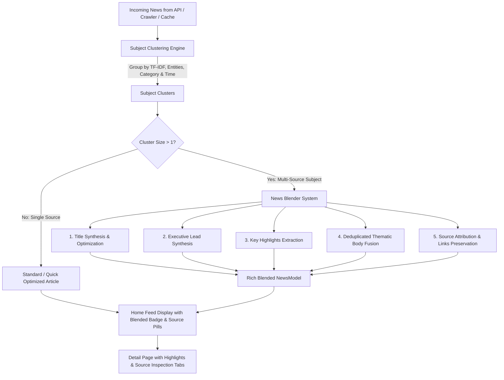

# News Gathering, Subject Grouping & Article Blender System

## Summary

This plan introduces a complete **Topic Grouping & Article Blender System** for YallaNews. When news articles cover the same subject or event across multiple Moroccan/Arabic outlets (Hespress, Le360, Alyaoum24, ChoufTV, etc.), the system:
1. Gathers and clusters articles covering the same story/subject using semantic multi-signal similarity.
2. Synthesizes a single **rich, optimized, and cohesive master article** that blends facts, quotes, context, and key highlights from all sources without duplication.
3. Preserves all source attribution information: accurate source count, domain names, original headlines, and direct source links.
4. Seamlessly updates the UI (`HomePage` and `NewsDetailPage`) to display blended stories, source chips, key highlight boxes, and a toggle to inspect each original source article.

---

## Architecture & Workflow

---

## Proposed Changes

### 1. Data Models & Helpers

#### [MODIFY] [news_model.dart](file:///d:/FLUTTER_PROJECTS/YallaNews/lib/models/news_model.dart)
- Add `isBlended` getter (`sourceCount > 1 || sources.length > 1`).
- Add helper getters for `highlights` (extracted key points from `structuredData['highlights']`).
- Add helper for `sourceAttributions`: typed getter returning list of `{name, domain, url, title, publishDate}`.
- Ensure `relatedArticles` and `sources` persist properly during copy and JSON serialization.

---

### 2. Subject Grouping & Clustering Service

#### [MODIFY] [news_grouping_service.dart](file:///d:/FLUTTER_PROJECTS/YallaNews/lib/services/news_grouping_service.dart)
- Upgrade `NewsGroupingService` to perform full subject/story clustering:
  - Multi-signal similarity using `SemanticCluster` (TF-IDF cosine similarity, named entities overlap, publish time proximity, keyword Jaccard overlap).
  - Subject title generation: extracts the core topic/subject identifier for each cluster (e.g. "مباراة المغرب وإسبانيا", "تطورات أسعار المحروقات بالمغرب").
  - Filter out junk titles or broken fragments.

---

### 3. News Blender System — [NEW]

#### [NEW] [news_blender_service.dart](file:///d:/FLUTTER_PROJECTS/YallaNews/lib/services/news_blender_service.dart)
A dedicated, offline-first intelligent blending engine that:
1. **Headline Optimization (`synthesizeTitle`)**:
   - Evaluates titles across all sources in the subject cluster.
   - Rewards informative named entities, appropriate length, and source reliability; penalizes clickbait clichés ("شاهد بالفيديو", "لن تصدق", "عاجل").
2. **Executive Lead Synthesis (`synthesizeLead`)**:
   - Integrates the top source leads into a clear, factual, unified opening answering Who, What, When, Where.
3. **Key Highlights Extraction (`extractHighlights`)**:
   - Identifies 3–5 unique, high-value factual bullet points across all articles.
   - Deduplicates sentences so each highlight provides novel information.
4. **Thematic Body Fusion (`blendContent`)**:
   - Segments paragraphs and sentences from all participating articles.
   - Cleans promotional fluff, boilerplate, social links, and copyright notices.
   - Deduplicates sentences with high Jaccard/stemmed token overlap.
   - Organizes content into structured thematic sections:
     - `### تفاصيل الوقائع والأحداث` (Details and core facts)
     - `### التصريحات والمواقف` (Official quotes and statements, explicitly crediting reporting outlets)
     - `### السياق والأبعاد` (Background and implications)
5. **Source Attribution & Link Preservation**:
   - Preserves `sourceCount`.
   - Aggregates all `sources` URLs.
   - Formats complete source attribution items with outlet name (e.g., Hespress, Le360, Alyaoum24, etc.), domain, original title, and URL.
   - Stores original unblended `NewsModel` articles in `relatedArticles`.
6. **Sentiment & Entity Fusion**:
   - Merges and deduplicates named entities (persons, locations, organizations).
   - Computes weighted sentiment.

---

### 4. UI: Home Page Feed

#### [MODIFY] [home_page.dart](file:///d:/FLUTTER_PROJECTS/YallaNews/lib/views/home_page.dart)
- Run `NewsBlenderService.instance.blendArticles(...)` on articles loaded from the API or background crawler.
- On article cards (`_buildArticleCard` and wide-screen cards):
  - When `article.isBlended`:
    - Display an AI Blender badge: `مقال مدمج • {sourceCount} مصادر` with `Icons.auto_awesome_rounded`.
    - Display compact domain pills (e.g., `hespress.com`, `le360.ma`) indicating the contributing news outlets.
- Add an optional filter/tab in category chips or header to view "المواضيع المدمجة" (Blended Topics) alongside standard feeds.

---

### 5. UI: News Detail Page

#### [MODIFY] [news_detail_page.dart](file:///d:/FLUTTER_PROJECTS/YallaNews/lib/views/news_detail_page.dart)
- When viewing a blended article:
  - **Header Banner**: Display a modern card: `مقال موحد ومدمج بالذكاء الاصطناعي من {sourceCount} مصادر موثوقة`.
  - **Key Highlights Card ("أبرز معطيات الخبر")**: Renders synthesized bullet points in a polished, readable card with icon bullets.
  - **Rich Body Content**: Renders the blended multi-source content with section headings and typography.
  - **Contributing Sources Section**:
    - Shows each contributing source card with outlet logo/domain, original title, and a button to open the original source article in-app or in a browser.
  - **Tabs / Toggle**: Allows the reader to switch between:
    - **التقرير الموحد المدمج** (Synthesized Comprehensive Article)
    - **المصادر والمقالات الأصلية** (Original Articles from each source), letting the user read each outlet's raw report side by side.

---

### 6. Localization

#### [MODIFY] [app_localizations.dart](file:///d:/FLUTTER_PROJECTS/YallaNews/lib/l10n/app_localizations.dart)
- Add Arabic, English, French, and Turkish localization strings for:
  - `blendedArticle` ("مقال مدمج ومحسن")
  - `blendedFromSources` ("تم الدمج من {count} مصادر إخبارية")
  - `keyHighlights` ("أبرز المعطيات والنقاط")
  - `contributingSources` ("المصادر الإخبارية المساهمة")
  - `readOriginal` ("قراءة المصدر الأصلي")
  - `synthesizedArticle` ("التقرير الموحد")
  - `originalArticles` ("المقالات الأصلية ({count})")

---

## Verification Plan

### Automated Tests
- Create a test `test/news_blender_test.dart`:
  - Verify that articles covering the same subject with similar entities are clustered together.
  - Verify that `NewsBlenderService` creates a blended article with combined content, deduplicated sentences, and correct `sourceCount`.
  - Verify that all source URLs, domains, and titles are preserved.
  - Run `flutter test test/news_blender_test.dart`.
- Run `flutter analyze` to ensure zero compilation errors and clean Dart code.

### Manual Verification
- Launch the app or verify with sample news datasets.
- Inspect the home feed to confirm blended badges and source pills appear on clustered articles.
- Tap a blended article to open `NewsDetailPage`:
  - Check the Key Highlights box.
  - Check the synthesized content structure.
  - Verify the Contributing Sources cards and open source links.
  - Toggle between Synthesized Report and Original Articles.
